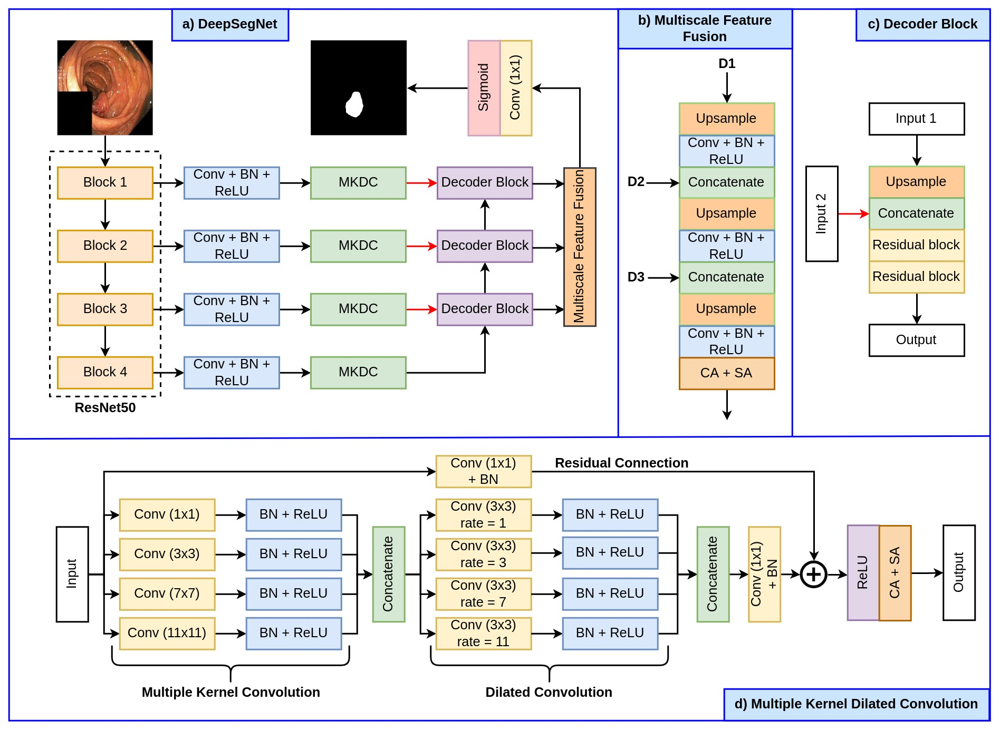
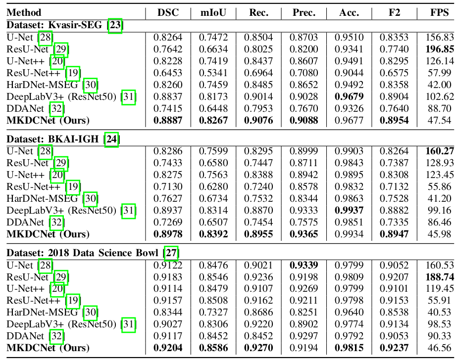
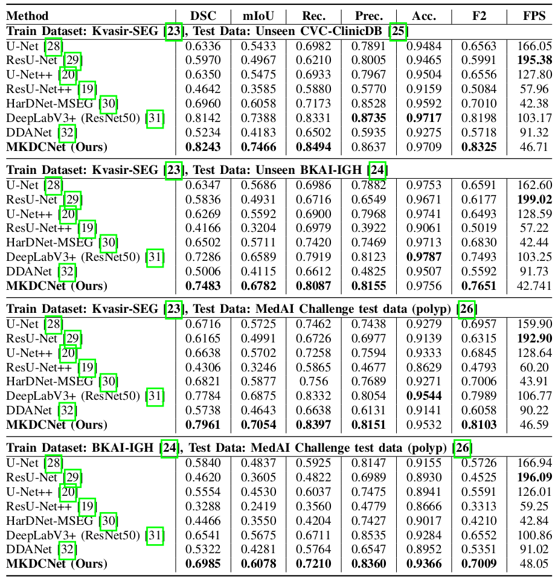
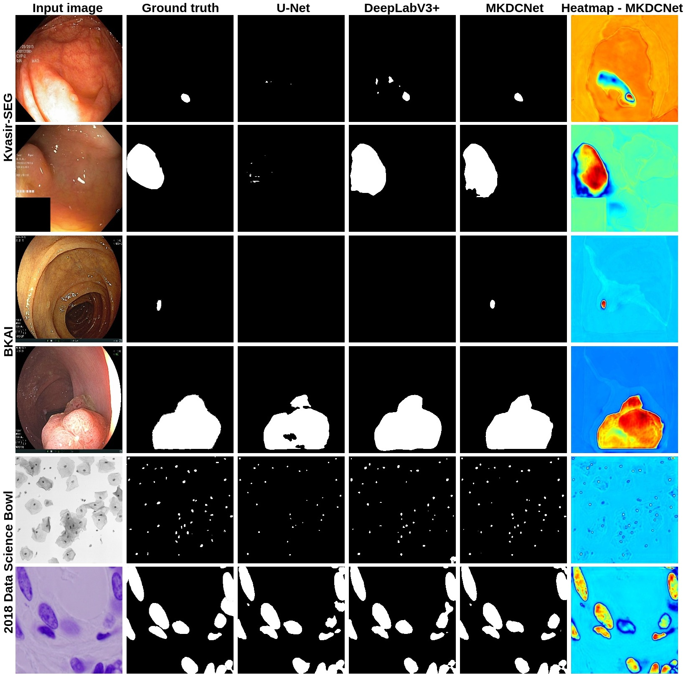

# Automatic Polyp Segmentation with Multiple Kernel Dilated Convolution Network
## 1. MKDCNet: Multitple Kernel Dilated Convolution Network 

The detection and removal of precancerous polyps through colonoscopy is the primary technique for the prevention of colorectal cancer worldwide. However, the miss rate of colorectal polyp varies significantly among the endoscopists. It is well known that a computer-aided diagnosis (CAD) system can assist endoscopists in detecting colon polyps and minimize the variation among endoscopists. In this study, we introduce a novel deep learning architecture, named <i>MKDCNet</i>, for automatic polyp segmentation robust to significant changes in polyp data distribution. MKDCNet is simply an encoder-decoder neural network that uses the pre-trained <i>ResNet50</i> as the encoder and novel <i>multiple kernel dilated convolution (MKDC)</i> block that expands the field of view to learn more robust and heterogeneous representation. Extensive experiments on four publicly available polyp datasets and cell nuclei dataset show that the proposed MKDCNet outperforms the state-of-the-art methods when trained and tested on the same dataset as well when tested on unseen polyp datasets from different distributions. With rich results, we demonstrated the robustness of the proposed architecture. From an efficiency perspective, our algorithm can process at approximately 45 frames per second on RTX 3090 GPU. MKDCNet can be a strong benchmark for building real-time systems for clinical colonoscopies.
 

## 2. Block digram of the proposed MKDCNet
|  |
| :--: |
| *Block diagram of the Multiple Kernel Dilated Convolution Network* |

## 3. Implementation
The proposed architecture is implemented using the PyTorch framework (1.9.0+cu111) with a single GeForce RTX 3090 GPU of 24 GB memory. 

### 3.1 Dataset
We have used the following datasets:
- [Kvasir-SEG](https://datasets.simula.no/downloads/kvasir-seg.zip)
- [BKAI](https://www.kaggle.com/competitions/bkai-igh-neopolyp/data)
- [2018 Data Science Bowl (stage1_train.zip)](https://www.kaggle.com/competitions/data-science-bowl-2018/data)

All the dataset follows an 80:10:10 split for training, validation and testing, except for the Kvasir-SEG, where the dataset is split into training and testing. 

### 3.2 Weight file
You can download the weight file from the following links:
- [Kvasir-SEG](https://drive.google.com/file/d/1QHRypbQvQwKhe6W9SHmN72FLHjkEVb0F/view?usp=sharing)
- [BKAI](https://drive.google.com/file/d/1zHmi8-e66eW5FnrqzV3seBkjNidRz2iZ/view?usp=sharing)
- [2018 Data Science Bowl](https://drive.google.com/file/d/1gRQfksMbie9XEY_USxdEvI770edyPkjs/view?usp=sharing)

## 4. Quantitative Results
Qualitative result comparison of the model trained and tested on several medical image segmentation dataset  
 
### 4.1 Same dataset
|  |
| :--: |
| *Quantitative results on the experimented datasets* |

### 4.2 Cross dataset
|  |
| :--: |
| *Quantitative results on the unseen polyp dataset.* |

## 5. Qualitative Results and Heatmap
|  |
| :--: |
| *Qualitative result comparison of the model trained and tested on several medical image segmentation dataset* |

## 6. Citation
Please cite our work if you use it for your research and find it useful. 

<pre>
@INPROCEEDINGS{tomarMKDCNet,
  author={N.Tomar and A. Srivastava and U. Bagci and D. Jha},
  booktitle={Automatic Polyp Segmentation with Multiple Kernel Dilated Convolution Network}, 
  year={2022}}
</pre>

## 7. License
The source code is free for research and education use only. Any comercial use should get formal permission first.

## 8. Contact
Please contact nikhilroxtomar@gmail.com for any further questions. 
