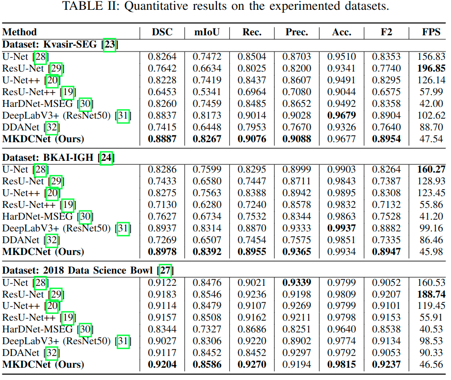
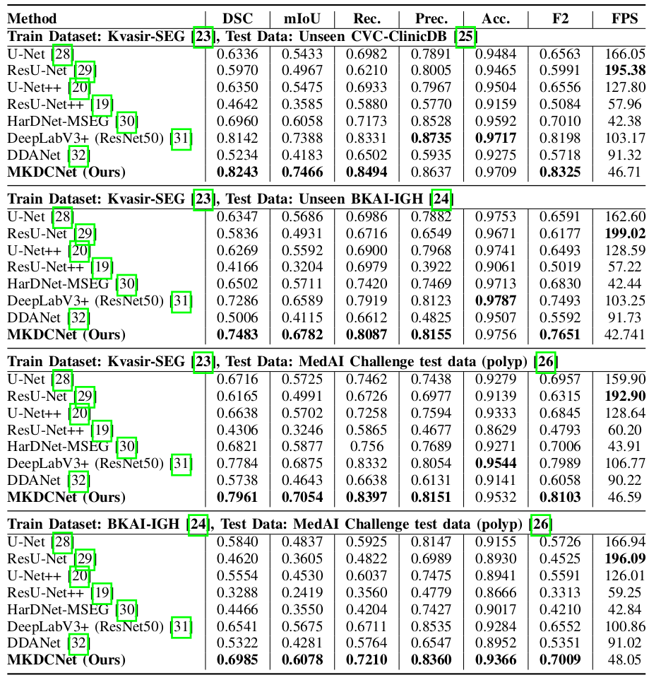

# Automatic Polyp Segmentation with Multiple Kernel Dilated Convolution Network
## MKDCNet: Multitple Kernel Dilated Convolution Network 

The detection and removal of precancerous polyps through colonoscopy is the primary technique for the prevention of colorectal cancer worldwide. However, the miss rate of colorectal polyp varies significantly among the endoscopists. It is well known that a computer-aided diagnosis (CAD) system can assist endoscopists in detecting colon polyps and minimize the variation among endoscopists. In this study, we introduce a novel deep learning architecture, named <i>MKDCNet</i>, for automatic polyp segmentation robust to significant changes in polyp data distribution. MKDCNet is simply an encoder-decoder neural network that uses the pre-trained <i>ResNet50</i> as the encoder and novel <i>multiple kernel dilated convolution (MKDC)</i> block that expands the field of view to learn more robust and heterogeneous representation. Extensive experiments on four publicly available polyp datasets and cell nuclei dataset show that the proposed MKDCNet outperforms the state-of-the-art methods when trained and tested on the same dataset as well when tested on unseen polyp datasets from different distributions. With rich results, we demonstrated the robustness of the proposed architecture. From an efficiency perspective, our algorithm can process at approximately 45 frames per second on RTX 3090 GPU. MKDCNet can be a strong benchmark for building real-time systems for clinical colonoscopies.
 

## Block digram of the proposed MKDCNet
|  |
| :--: |
| *Block diagram of the Multiple Kernel Dilated Convolution Network* |

## Results (Quantitative results)
Qualitative result comparison of the model trained and tested on several medical image segmentation dataset  

## Results (Qualitative results and Heatmap)
|  |
| :--: |
| *Qualitative result comparison of the model trained and tested on several medical image segmentation dataset* |

## Citation
Please cite our work if you find it useful. 

<pre>
@INPROCEEDINGS{tomarMKDCNet,
  author={N.Tomar and A. Srivastava and U. Bagci and D. Jha},
  title={Automatic Polyp Segmentation with Multiple Kernel Dilated Convolution Network}, 
  year={2022}}
</pre>
